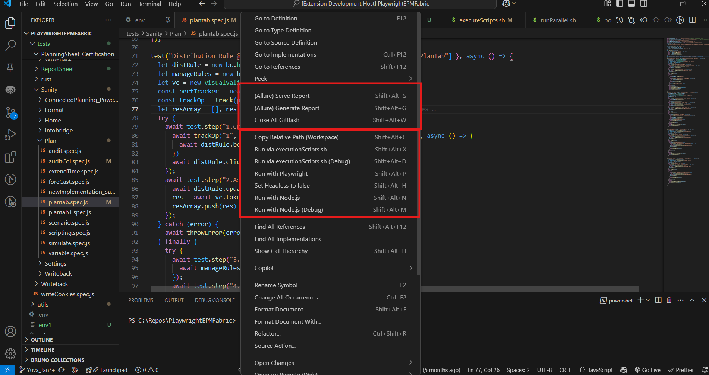

## Overview
OneClickRun is a Visual Studio Code extension that streamlines running test scripts (.js) via executeScripts, Playwright & Node, manages Allure report generation and serving, closes git bash windows, and enables quick copying of relative paths.

## Why?
In day-to-day development and test automation, we often repeat the same manual steps just to run a script or test:

1. Copy the workspace-relative path of a file
2. Paste it into the .env file under the TESTNAME key
3. Open a terminal and manually run executeScripts.sh

These steps are simple — but repetitive, time-consuming, and error-prone.

One Click Run replaces this entire workflow with a single UI command.
With a right-click action, it automatically updates the .env file and triggers the required script execution, letting you focus on writing and debugging code instead of repeating setup steps.

## Features
- Instantly run or debug test scripts using executionScripts.sh
- Generate and serve Allure reports with one click
- Run tests with Playwright (auto-detects Playwright in your workspace)
- Copy relative file paths directly from the context menu
- Context menu and editor integration for quick access
- Customizable keybindings for all major actions
- Conditional menu options (e.g., Playwright actions only appear for `spec.js` files and when Playwright is present)
- Status messages for script execution and reporting
- Keybindings/Shortcut Keys for quick actions
- Run scripts with Node.js
- Toggle headless mode for Playwright
- Close git bash window after script execution

## Keybindings
| Keybinding | Action |
| ---------- | ------ |
| Shift+Alt+S | Serve Allure report |
| Shift+Alt+G | Generate Allure report |
| Shift+Alt+W | Close All GitBash |
| Shift+Alt+C | Copy Relative Path (Workspace) |
| Shift+Alt+X | Run via executionScripts.sh |
| Shift+Alt+D | Run via executionScripts.sh (Debug) |
| Shift+Alt+P | Run with Playwright |
| Shift+Alt+H | Toggle headless mode |
| Shift+Alt+N | Run with Node.js |
| Shift+Alt+M | Run with Node.js (Debug) |

### Images

## Status Message
