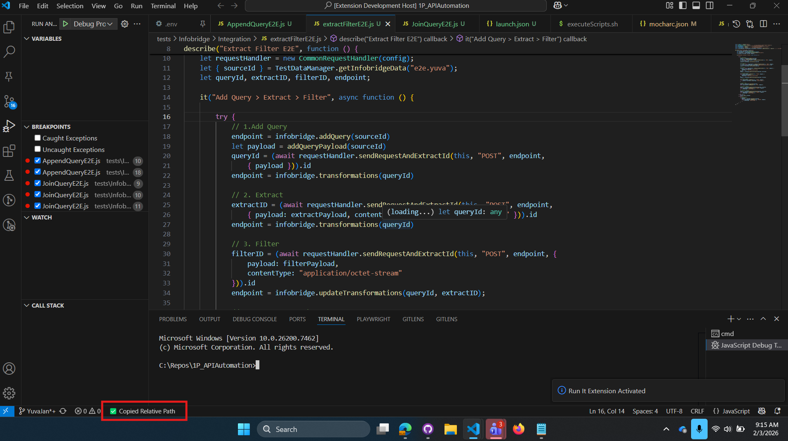

## Overview

RunIt (OneClickRun) is a Visual Studio Code extension that streamlines running test scripts (.js) via executeScripts & Playwright, manages Allure report generation and serving, and enables quick copying of relative paths.

## Features

- Instantly run or debug test scripts using executionScripts.sh
- Generate and serve Allure reports with one click
- Run tests with Playwright (auto-detects Playwright in your workspace)
- Copy relative file paths directly from the context menu
- Context menu and editor integration for quick access
- Customizable keybindings for all major actions
- Conditional menu options (e.g., Playwright actions only appear for `spec.js` files and when Playwright is present)
- Status messages for script execution and reporting

## Keybindings

| Keybinding      | Action                               |
| --------------- | ------------------------------------ |
| Shift + Alt + X | Run via `executeScripts.sh`          |
| Shift + Alt + D | Run via `executeScripts.sh` (Debug)  |
| Shift + Alt + T | Trigger `executeScripts.sh`          |
| Shift + Alt + Y | Trigger `executeScripts.sh` (Debug)  |
| Shift + Alt + C | Copy relative path                   |
| Shift + Alt + S | Serve Allure report                  |
| Shift + Alt + G | Generate Allure report               |
| Shift + Alt + P | Run with Playwright (Headed)         |
| Shift + Alt + O | Run with Playwright (Headed + Debug) |
| Shift + Alt + H | Toggle Playwright headless mode      |
| Shift + Alt + N | Run with Node.js                     |
| Shift + Alt + M | Run with Node.js (Debug)             |
| Shift + Alt + W | Close all Git Bash                   |

## Images

## Status Message

